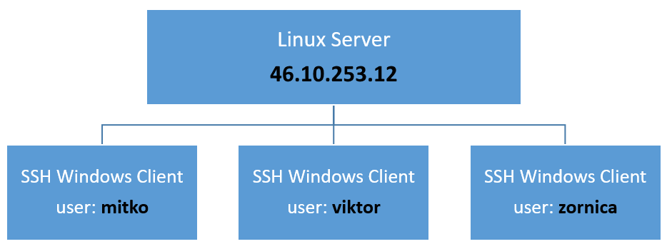

## Работна среда

Работната среда се състои от един Линукс сървър с реален Интернет протокол адрес **46.10.253.12** и множество Windows клиенти. Достъпа на клиентите до сървъра се осъществява посредством [Telnet](https://en.wikipedia.org/wiki/Telnet)  използвайки [SSH](https://bg.wikipedia.org/wiki/SSH ).
 
  
 
Telnet е разработен през 1969 г., като се започне с [RFC 15](https://tools.ietf.org/html/rfc15), разширен в [RFC 854](https://tools.ietf.org/html/rfc854) и стандартизиран като интернет стандарт [STD 8](https://en.wikipedia.org/wiki/STD_8)  на  [Internet Engineering Task Force](https://en.wikipedia.org/wiki/Internet_Engineering_Task_Force), един от първите интернет стандарти. Telnet осигурява достъп до интерфейс на командния ред на отдалечен хост до мрежови устройства и/или операционни системи. Поради сериозните опасения за сигурността при използването на Telnet през отворена мрежа като Интернет, използването му за тази цел значително намаля в полза на SSH.

SSH използва криптография с публичен ключ, за да удостовери отдалечения компютър и да му позволи да удостовери потребителя, ако е необходимо. Протоколът обикновено се използва за влизане в отдалечена машина и изпълнение на команди. Той може да прехвърля файлове, като използва свързаните протоколи за прехвърляне на файлове (SFTP) или защитени копия (SCP).
 
Системният софтуер включва шелл (shell), текстов редактор (text editor), компилатор (compiler) и дебъгер (debugger), инструменти (tools) и демони (daemons) на операционната система. Тези компоненти са изцяло системен софтуер, базиран на ядрото и библиотеката C.

 