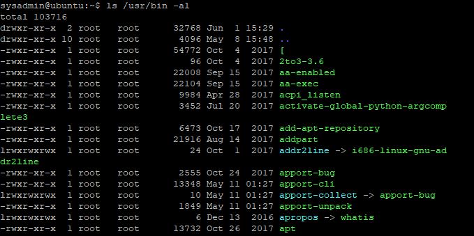

## Файлови разрешения

Традиционната файлова система определя три режима за използване на всеки файл: четене (read), запис (write) или изпълнение (execute). Също така съществуват три нива на правата за достъп до файлови операции: собственик (owner), група (group) и публично (public). 

  

  

В операционна система Линукс съществуват и специални режими, така че някои файлове могат да имат (**s**) вместо (**x**) на потребителско ниво, което означава че е зададен специален флаг **SUID**. Когато е зададен този специален флаг, то всъщност **UID** става този на собственика на файла, вместо на потребителят изпълнил командата.

Полезна информация: [Quick introduction to SUID: What you need to know](https://www.techrepublic.com/blog/linux-and-open-source/quick-introduction-to-suid-what-you-need-to-know/) и [What is SUID, SGID and Sticky bit?](https://www.thegeekdiary.com/what-is-suid-sgid-and-sticky-bit/).