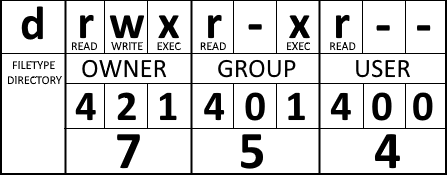

## Файлови права

Традиционните файлови системи поддържат три **режима** за използване на файловете: 
**четене** (_Термин на Английски език: Read_), 
**запис** (_Термин на Английски език: Write_) и
**изпълнение** (_Термин на Английски език: Execute_). 

От друга страна, всеки файл в Линукс принадлежи на **потребител** и **група**, 
като по подразбиране, това са създателя на файла и първичната му група. 
На базата на това са дефинирани три **нива** на правата за достъп до файлови операции: 
**собственик** (_Термин на Английски език: Owner_), 
**група** (_Термин на Английски език: Group_) и 
**публика** (_Термин на Английски език: Public_). 

Чрез комбинирането на трите нива и трите режима се получават 9 възможни характеристики на файловете, 
които могат да се представят със следната битова маска (първият флаг показва дали полето описва директория или файл):



На горния пример, притежателят на файла има пълни права над файла, членовете на групата на файла имат права за четене и изпълнение, а всички останали потребители имат само право за четене.

В конзолен режим на Линукс може да разгледаме правата на елементите в текущата директория с помощта на командата:
```
ls -la
```

  

В Линукс има дефинирани допълнителни специални режими за файловете и директориите. Един от тези режими е **SUID** (_Съкратено от: Set-User IDentification_) и в маската за правата се идентифицира със `(s)` вместо `(x)` на ниво собственик. Когато файл с изпълним код е в този режим и бъде изпълнен, то създадените процеси и ресурси ще принадлежат на собственика на файла, а не на потребителя, стартирал приложението.

Друг специален режим е **SGID** (_Съкратено от: Set-Group IDentification_) и се идентифицира със `(s)` вместо `(x)` на ниво група. Когато файл с изпълним код е в този режим и бъде изпълнен, то създадените процеси и ресурси ще принадлежат на групата на собственика на файла, а не на потребителя, стартирал приложението. Когато директория е в режим **SGID**, то създадените в нея файлове по подразбиране ще принадлежат на групата на горната директория.

Режимът **Sticky bit**, който се идентифицира със `(s)` вместо `(x)` на общо ниво, често се използва за споделени директории. Когато директория е в този режим, потребителите имат право да четат и изпълняват файлове на други потребители, но не могат да ги изтриват или преименуват.
