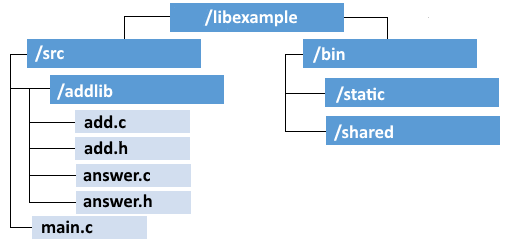

## Библиотеки

Библиотеките представляват множество компилирани обекти в един файл. 

Техните преимущества са: **повторно използване на компоненти** (използване на една споделена библиотека заема по-малко място на диска), **управление на версиите** (стари и нови версии съжителстват едновременно на една Linux система), **компонентна специализация** (разработчиците могат да  фокусират основната си компетентност в една библиотека).

Видовете библиотеки са: **статични** (обектен код в свързана библиотека, който става част от приложението) и **динамични** (споделени обекти, динамично свързвани по време на изпълнението).

### Структура на библиотека

На фигурата по-долу е дадена примерна структура на библиотека:



### Структура на директориите

Използвайте следните команди да създадете структурата на директориите:
```
mkdir libexample
mkdir libexample/src
mkdir libexample/src/addlib
mkdir libexample/bin
mkdir libexample/bin/static
mkdir libexample/bin/shared
```
Източник:
[Creating a shared and static library with the gnu compiler gcc]( https://renenyffenegger.ch/notes/development/languages/C-C-plus-plus/GCC/create-libraries/index)

### Файлове на библиотеката

В папка `libexample/src/addlib/` създайте файл `add.c` със следното съдържание:
```
#include <stdio.h>
int gSummand;
void setSummand(int summand) {
	gSummand = summand;
}
int add(int summand) {
	return gSummand + summand;
}
void __attribute__ ((constructor)) initLibrary(void) {
	printf("Library is initialized\n"); 
	gSummand = 0;
}
void __attribute__ ((destructor)) cleanUpLibrary(void) {
	printf("Library is exited\n"); 
}
```
В папка `libexample/src/addlib/` създайте файл `add.h` със следното съдържание:
```
void setSummand(int summand);
int add(int summand);
```
В папка `libexample/src/addlib/` създайте файл `answer.c` със следното съдържание:
```
#include "add.h"
int answer() {
	setSummand(20);
	return add(22); // 42 = 20 + 22
}
```
В папка `libexample/src/addlib/` създайте файл `add.h` със следното съдържание:
```
int answer();
```
В папка `libexample/src/` създайте файл `main.c` със следното съдържание:
```
#include <stdio.h>
#include "addlib/add.h"
#include "addlib/answer.h"
int main(int argc, char* argv[])
{
	setSummand(5);
	printf("5 + 7 = %d\n", add(7));
	printf("And the answer is: %d\n", answer());
	return 0;
}
```
