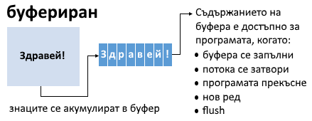

## Буферирани срещу небуферирани потоци

Потокът представлява предаване на данни от една страна към друга. Файлът представлява място за съхраняване на данни на диск. Файлът използва потоци за съхранение и зареждане на данни. Буферът се използва временно за съхраняване на данните от потока.

Знаците, написани или четени от **небуфериран поток** (unbuffered stream), се предават поотделно във или от файла възможно най-скоро. Знаци, написани или четени от **напълно буфериран поток** (fully buffered), се предават към или от файла в блокове с произволен размер. Знаците, написани на **линейно буфериран поток** (line buffered stream), се предават към файла в блокове, когато се появява нов ред.

### Файлови операции на ниско ниво -  небуфериран поток
Методите **open()**, **read()**, **write()**, **lseek()** са част от библиотеката **<unistd.h>**. Работят с файловия дескриптор **(INT)** и третират входно/изходния поток като бинарни данни.

 

### Файлови операции на ниско ниво - буфериран поток
Методите **fopen()**, **fread()**, **fwrite()**, **fseek()** са част от библиотеката **<stdio.h>**. Използват обектния тип **FILE** и третират входно/изходния поток като текст. Операциите по четене/запис на акумулирания буфер може да бъде форсирани посредством метод **fflush()**.

 
